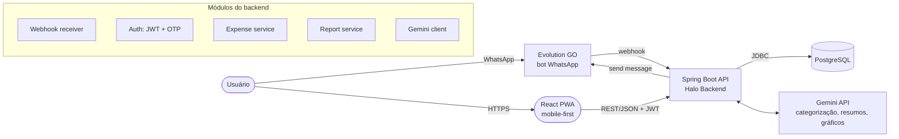
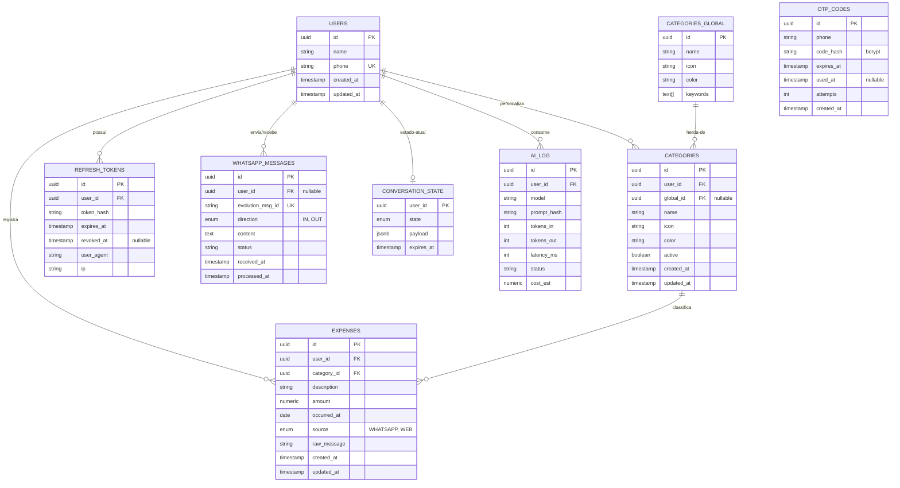
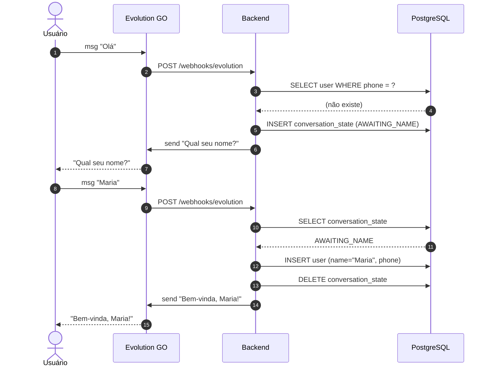
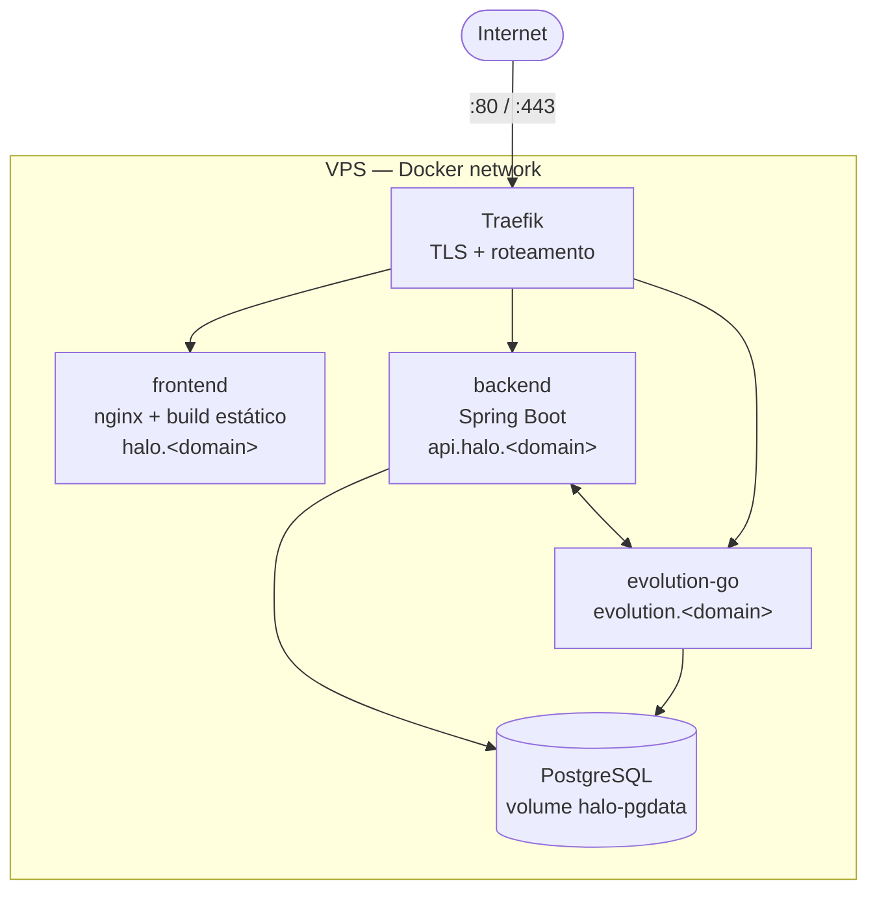

# Análise Técnica — Projeto Halo

> Documento de arquitetura para o controle de gastos pessoais via WhatsApp + Web.
> Baseado em [ideia-inicial.md](./ideia-inicial.md) e nas decisões alinhadas com o time.

---

## 1. Visão Geral

O Halo é uma aplicação **conversacional** para registro de gastos pessoais. O canal primário de entrada é o **WhatsApp** (sem instalação de app), com auxílio de IA para interpretação/categorização. O canal secundário é uma **PWA mobile-first** para consulta detalhada, edição e gerência de categorias.

### 1.1 Personas e cenários
- **Usuário final**: pessoa que quer registrar gastos rapidamente, sem fricção.
- **Cenário 1 — registro rápido**: usuário manda "Mercado 87,30" no WhatsApp → bot confirma com categoria sugerida.
- **Cenário 2 — consulta mensal**: usuário pede "resumo deste mês" → recebe tabela em texto + imagem com gráfico.
- **Cenário 3 — gestão**: usuário abre a web, ajusta lançamentos antigos, cria categoria customizada.

### 1.2 Objetivos não-funcionais
| Atributo | Meta MVP |
|---|---|
| Tempo de resposta WhatsApp (texto) | < 3s p95 |
| Tempo de resposta WhatsApp (gráfico) | < 8s p95 |
| Disponibilidade | 99% (single-VPS, best-effort) |
| Resiliência IA | degradação graciosa: se IA falha, registra com categoria "Sem categoria" |
| Custo IA por usuário/mês | < R$ 1,00 (target) |

---

## 2. Decisões Arquiteturais (ADR resumido)

| # | Decisão | Justificativa |
|---|---|---|
| 1 | Monorepo simples (`backend/`, `frontend/`) | Projeto pequeno, baixa complexidade, sem necessidade de orquestrador. |
| 2 | Spring Boot 3.x + Java 21 | Stack mandada pela disciplina; LTS atual; bom para webhooks síncronos. |
| 3 | PostgreSQL 16 | Stack mandada; relacional cobre 100% do modelo. |
| 4 | React 18 + Vite + Tailwind | Bundler rápido para dev; Tailwind alinhado com mobile-first. |
| 5 | Evolution GO — instância única do bot | 1 número Halo recebe mensagens de todos via webhook; identificação por telefone do remetente. |
| 6 | JWT access (15min) + refresh (30 dias) | Stateless, alinhado a frontend SPA; refresh em cookie httpOnly. |
| 7 | OTP via WhatsApp (sem senha) | Reduz fricção e elimina gestão de senha. |
| 8 | Categorias globais padrão + customizadas por usuário | Onboarding rápido (cobertura imediata) + personalização. |
| 9 | Gemini só com texto no MVP | Áudio/imagem ficam para fase 2 (escopo + custo). |
| 10 | Deploy VPS + Docker Compose | Controle total, custo baixo, simples para MVP educacional. |
| 11 | Conta independente por telefone | Sem workspaces/compartilhamento — reduz drasticamente o schema. |
| 12 | Gráficos: tabela em texto + imagem gerada com auxílio do Gemini | Detalhado na seção 9.3 (há um trade-off importante de confiabilidade). |

---

## 3. Arquitetura de Alto Nível



Todos os componentes (Evolution GO, Postgres, Backend, Frontend nginx) rodam **na mesma VPS** via Docker Compose. Comunicação interna por rede docker; HTTPS terminado em **Traefik** ou **nginx reverse proxy** (ver §13).

---

## 4. Stack Detalhada

### 4.1 Backend
- **Java 21 (LTS)** + **Spring Boot 3.3.x**
- **Spring Web** (controllers REST)
- **Spring Data JPA** + **Hibernate**
- **Spring Security** (filtros JWT customizados)
- **Flyway** (migrations versionadas em `db/migration`)
- **Springdoc OpenAPI** (Swagger UI em `/swagger-ui.html`)
- **JJWT 0.12.x** (geração/validação de tokens)
- **RestClient** (Spring 6+, substitui RestTemplate) para Evolution e Gemini
- **Bucket4j** (rate limit em endpoints sensíveis como `/auth/otp/request`)
- **Lombok**, **MapStruct** (boilerplate)
- **JUnit 5** + **Testcontainers** (testes de integração com Postgres real)

### 4.2 Frontend
- **React 18** + **TypeScript** + **Vite**
- **TailwindCSS 3** (mobile-first; breakpoints sm/md desktop)
- **React Router v6**
- **TanStack Query** (cache de chamadas REST, refetch automático)
- **React Hook Form** + **Zod** (formulários + validação)
- **Recharts** (gráficos na web)
- **Axios** (interceptor para renovação automática de access token)
- **dayjs** (datas; mais leve que moment)
- **vite-plugin-pwa** (cache offline básico, ícone na home screen)

### 4.3 Banco e Infra
- **PostgreSQL 16** (container oficial)
- **Evolution GO** (container, conforme docs)
- **Traefik 3** ou **nginx** (reverse proxy + TLS via Let's Encrypt)
- **Loki + Promtail + Grafana** (opcional, fase 2) para logs centralizados

---

## 5. Estrutura do Monorepo

```
sctec-miniprojeto-halo/
├── docs/
│   ├── ideia-inicial.md
│   └── analise-tecnica.md          # este documento
├── backend/
│   ├── src/main/java/dev/halo/
│   │   ├── HaloApplication.java
│   │   ├── auth/                    # OTP, JWT, filtros
│   │   ├── user/                    # User, perfil
│   │   ├── expense/                 # Expense, ExpenseService, controller
│   │   ├── category/                # Categorias globais e por usuário
│   │   ├── whatsapp/                # Webhook, EvolutionClient, parser de comandos
│   │   ├── ai/                      # GeminiClient, prompts, classificador
│   │   ├── report/                  # Geração de resumos e gráficos
│   │   └── common/                  # Configs, exceptions, security, audit
│   ├── src/main/resources/
│   │   ├── application.yml
│   │   └── db/migration/V1__init.sql ...
│   ├── src/test/...
│   ├── Dockerfile
│   ├── pom.xml
│   └── README.md
├── frontend/
│   ├── src/
│   │   ├── pages/                   # Login, Dashboard, Expenses, Categories
│   │   ├── components/
│   │   ├── hooks/
│   │   ├── api/                     # cliente axios + queries
│   │   ├── stores/                  # zustand (auth)
│   │   ├── App.tsx
│   │   └── main.tsx
│   ├── public/
│   ├── Dockerfile
│   ├── vite.config.ts
│   ├── tailwind.config.js
│   ├── tsconfig.json
│   └── package.json
├── infra/
│   ├── docker-compose.yml
│   ├── docker-compose.prod.yml
│   ├── traefik/
│   │   └── traefik.yml
│   └── .env.example
├── .gitignore
├── LICENSE
└── README.md
```

---

## 6. Modelo de Dados

### 6.1 Diagrama lógico



### 6.2 Notas sobre o schema
- **UUID v7** como PK (ordenável, melhor que v4 para índices).
- **`expenses.amount`** = `numeric(12,2)`; nunca `float`.
- **`expenses.source`** = `enum('WHATSAPP','WEB')`.
- **`categories.global_id`** liga ao seed global (para herdar ícone/cor mas permitir override).
- **`whatsapp_messages.evolution_msg_id` UNIQUE** garante idempotência do webhook (mesma mensagem entregue 2x não duplica gasto).
- **`conversation_state`** TTL curto (15min) com job de limpeza diário.
- **`otp_codes`**: armazenar **hash bcrypt** (nunca texto puro), TTL 5min, max 5 tentativas.

### 6.3 Seed de categorias globais (sugestão inicial)
Alimentação, Mercado, Transporte, Lazer, Saúde, Moradia, Educação, Vestuário, Serviços, Investimento, Renda, Outros.

---

## 7. Fluxos Principais

### 7.1 Cadastro via WhatsApp (primeiro contato)


### 7.2 Registro de gasto via WhatsApp
1. Webhook recebe `messages.upsert`.
2. Backend valida origem (token do header), busca/cria registro em `whatsapp_messages` (idempotência por `evolution_msg_id`).
3. Identifica usuário pelo telefone.
4. Se não está em fluxo conversacional, chama **GeminiClient.parseExpense(text)**.
5. Gemini retorna JSON estruturado: `{ description, amount, category_hint, date }`.
6. Backend resolve categoria (global ou do usuário, via keywords / hint) e persiste `expense`.
7. Backend responde via Evolution: "Registrado: Mercado R$ 87,30 → Alimentação. Data: 18/05. Responda 'mudar categoria' para ajustar."

### 7.3 Login Web (OTP)
1. Frontend: usuário digita telefone → `POST /auth/otp/request`.
2. Backend: gera código 6 dígitos, salva hash em `otp_codes`, envia via Evolution.
3. Frontend: usuário digita código → `POST /auth/otp/verify`.
4. Backend: valida hash + TTL + tentativas → emite **access JWT (15min)** + **refresh token (30d)**.
5. Refresh token em cookie `httpOnly; Secure; SameSite=Strict`. Access token em memória do app (não localStorage, para reduzir surface XSS).

### 7.4 Resumo mensal via WhatsApp
1. Usuário envia "resumo maio" ou "resumo".
2. Backend identifica comando (regex simples + fallback Gemini).
3. Agrega gastos do período (SQL `GROUP BY category, date_trunc`).
4. Monta **tabela em texto** formatada (monoespaçada com totais).
5. Para o gráfico: ver §9.3.
6. Envia 2 mensagens via Evolution: texto + imagem.

---

## 8. Integração com Evolution GO

### 8.1 Configuração da instância
- Uma única instância (`halo-bot`) criada via API Evolution.
- QR code escaneado pelo operador uma vez (número dedicado).
- Webhook apontando para `https://api.halo.dev/webhooks/evolution` (sem auth dedicada — Evolution Go não envia headers de auth em webhooks de saída; proteção por rede/reverse proxy, ver §10.3).
- Eventos assinados: `messages.upsert` (entrada) e opcionalmente `messages.update` (status de entrega).

### 8.2 Contrato do Webhook (recepção)

O Evolution Go envia um envelope Baileys / PascalCase (validado empiricamente em campo — diferente do Evolution API Node v2 que tinha sido especulado inicialmente). Resumo do que importa:

```json
{
  "event": "Message",
  "instanceName": "halo-bot",
  "instanceId": "9b02de74-...",
  "instanceToken": "tok-...",
  "data": {
    "Info": {
      "ID": "ABCD123",
      "Chat": "5547999999999@s.whatsapp.net",
      "Sender": "5547999999999@s.whatsapp.net",
      "IsFromMe": false,
      "IsGroup": false,
      "PushName": "Maria",
      "Timestamp": "2026-05-20T21:28:23-03:00",
      "Type": "text"
    },
    "Message": { "conversation": "Mercado 87,30" }
  }
}
```

Backend deve:
- **Não tentar autenticar** (Evolution Go self-hosted não envia auth em webhooks de saída — ver §10.3).
- Ignorar `Info.IsFromMe=true`.
- Extrair telefone (`Info.Chat` antes do `@`, normalizar para E.164).
- Usar `Info.ID` como `evolution_msg_id` para idempotência.

> Implementação: `EvolutionGoWebhookPayload` modela este wire format; `toCanonical()` converte para o DTO interno `EvolutionPayloadDto` consumido pelo `InboundMessageService`.

### 8.3 Envio de mensagem
- `POST /message/sendText/{instance}` para texto.
- `POST /message/sendMedia/{instance}` para imagem (gráfico em base64 ou URL).
- Implementar **retry com backoff exponencial** (3 tentativas, 1s/3s/9s) em erros 5xx.
- **Circuit breaker** (Resilience4j) para evitar cascata se Evolution cair.

---

## 9. Integração com Gemini

### 9.1 Modelos sugeridos
- **`gemini-2.5-flash`**: parser de gastos, comandos curtos, resumos textuais (rápido e barato).
- **`gemini-2.5-pro`**: somente se for necessária maior acurácia em casos complexos (fallback).

### 9.2 Prompt — parser de gasto (exemplo)
```
Você é um parser de despesas. Receba a mensagem do usuário e devolva APENAS
JSON válido no formato:
{
  "description": string,    // descrição curta
  "amount": number,          // valor em reais, ponto como decimal
  "category_hint": string,   // uma de [Alimentação, Mercado, Transporte, ...]
  "occurred_at": "YYYY-MM-DD" | null
}
Regras:
- Se a mensagem não parece descrever um gasto, devolva {"error":"NOT_EXPENSE"}.
- Se a data não foi informada, deixe null.
- Categorias válidas: <lista global + customizadas do usuário>.
Mensagem: """<texto do usuário>"""
```
Configurações: `responseMimeType=application/json` + `responseSchema` (OBJECT com 5 propriedades nullable — `description`, `amount`, `category_hint`, `occurred_at`, `error`), `temperature=0.2`, `maxOutputTokens=500`.

> **Por que `responseSchema`?** Observamos empiricamente (Issue #66) que `responseMimeType=application/json` sozinho não impede prosa antes do JSON ("Here is the JSON: {...}"), e `maxOutputTokens=200` truncava respostas no meio. O schema obriga o modelo a emitir um objeto schema-compliante; o bump pra 500 absorve respostas levemente maiores sem custo adicional perceptível.

### 9.3 Geração do gráfico — atenção
**Trade-off técnico importante**: o Gemini *consegue* gerar imagens (via modelos como `gemini-2.5-flash-image` / Imagen), mas **gráficos estatísticos com números exatos a partir de dados tabulares têm baixa confiabilidade** — labels e valores frequentemente saem com pequenas distorções.

Duas abordagens viáveis, em ordem de recomendação:

**Opção A (recomendada, híbrida):**
1. Backend agrega os dados (deterministicamente em SQL).
2. Gemini é chamado **apenas para sugerir o tipo de gráfico e cores** baseado nos dados.
3. Backend renderiza o gráfico com **JFreeChart** ou chama **QuickChart.io** (URL de imagem pública).
4. Resultado: gráfico exato, IA agrega valor sem riscar a precisão.

**Opção B (puramente IA, conforme pedido):**
1. Backend envia os dados agregados para o Gemini com prompt: "gere uma imagem de gráfico de barras com estes valores".
2. Recebe imagem em base64.
3. Encaminha para Evolution.
4. Risco: valores podem aparecer ligeiramente errados na imagem; latência maior; custo maior por chamada.

> **Recomendação**: começar com **Opção A** no MVP. Se houver tempo/budget, expor **Opção B** como flag (`USE_AI_CHART_GENERATION=true`) para experimentação.

### 9.4 Controle de custo
- Logar tokens consumidos por chamada em `ai_log`.
- Limitar tamanho de prompt (truncar mensagens > 500 chars).
- Cache de classificação por descrição normalizada (TTL 30 dias) — evita reprocessar "Uber" toda vez.

---

## 10. Autenticação e Segurança

### 10.1 Fluxo OTP
- Telefone normalizado para **E.164** (`+5547999999999`) antes de qualquer operação.
- **Código**: 6 dígitos numéricos (`SecureRandom`).
- **TTL**: 5 minutos.
- **Tentativas**: máx. 5 antes de invalidar o código.
- **Cooldown**: máx. 1 solicitação a cada 60s por telefone (Bucket4j em memória basta no MVP).

### 10.2 JWT
- **Access token**: assinatura HMAC-SHA256, claims `sub` (userId), `phone`, `exp` (15min).
- **Refresh token**: opaco (UUID), hash em DB; rotaciona a cada uso (revoga o anterior).
- **Logout**: `DELETE /auth/sessions/current` revoga o refresh token.

### 10.3 Hardening
- HTTPS obrigatório em produção (Traefik + Let's Encrypt).
- Headers de segurança: HSTS, CSP, X-Frame-Options, Referrer-Policy.
- CORS restritivo (apenas origin do frontend).
- Webhook do Evolution: **sem auth dedicada no endpoint** — o Evolution Go self-hosted não envia headers de auth em webhooks de saída (issue upstream #1933 da Evolution API, closed as not-planned), e tentativas de mover o segredo para o path da URL não funcionaram em campo. Proteção é por **rede** (Evolution roda na mesma VPS, IP interno docker) + **reverse proxy** (Traefik/nginx restringe origem do POST). *Histórico:* o design original previa header `apikey` — o T-008 entregou validação header-based, mas foi removida quando o Evolution Go real começou a chamar e nunca enviou o header.
- Logs **não** podem conter código OTP, mensagens completas com valores sensíveis, ou tokens JWT — apenas hashes/prefixos.

---

## 11. API REST (esboço)

| Método | Rota | Descrição | Auth |
|---|---|---|---|
| POST | `/webhooks/evolution` | Recebe eventos do WhatsApp | sem auth dedicada (proteção por rede/reverse proxy — ver §10.3) |
| POST | `/auth/otp/request` | Envia OTP via WhatsApp | público (rate-limited) |
| POST | `/auth/otp/verify` | Troca OTP por tokens | público |
| POST | `/auth/refresh` | Renova access token | refresh cookie |
| DELETE | `/auth/sessions/current` | Logout | JWT |
| GET | `/me` | Perfil do usuário | JWT |
| PATCH | `/me` | Atualiza nome | JWT |
| GET | `/expenses` | Lista paginada (filtros: from, to, category) | JWT |
| POST | `/expenses` | Cria gasto (web) | JWT |
| GET | `/expenses/{id}` | Detalhe | JWT |
| PATCH | `/expenses/{id}` | Edita | JWT |
| DELETE | `/expenses/{id}` | Soft delete | JWT |
| GET | `/categories` | Lista categorias do usuário + globais ativas | JWT |
| POST | `/categories` | Cria categoria customizada | JWT |
| PATCH | `/categories/{id}` | Edita customizada | JWT |
| DELETE | `/categories/{id}` | Desativa customizada | JWT |
| GET | `/reports/monthly?month=YYYY-MM` | Resumo do mês | JWT |
| GET | `/reports/categories?from=&to=` | Totais por categoria no período | JWT |

Documentação interativa exposta em `/swagger-ui.html` (apenas em dev/staging).

---

## 12. Frontend — Páginas e Componentes

### 12.1 Páginas (rotas)
- `/login` — entrada do telefone + tela de OTP (2 steps no mesmo componente).
- `/` (dashboard) — total do mês atual, top 5 categorias, gráfico, últimos 10 lançamentos.
- `/lancamentos` — lista filtrável + busca + botão "novo".
- `/lancamentos/:id` — detalhe/edição.
- `/categorias` — CRUD em modal/drawer.
- `/perfil` — nome + telefone + logout.

### 12.2 Design tokens (Tailwind)
- Paleta minimalista: 1 primária + 1 acento + neutros.
- Tipografia única (Inter ou system stack) com 4 escalas.
- Componentes base: Button, Input, Select, Modal, BottomSheet, Toast.
- **Bottom navigation** fixa (Dashboard, Lançamentos, Categorias, Perfil).

### 12.3 Estado
- **Auth** em Zustand (token em memória, expiração trackeada).
- **Server cache** em TanStack Query (5min stale-time padrão; `/me` 30min).
- **Forms** com React Hook Form + Zod (schema reaproveitado do backend via export OpenAPI futuramente).

---

## 13. Deploy e Infraestrutura

### 13.1 Docker Compose (visão lógica)



### 13.2 Containers
- `traefik`: reverse proxy + TLS automático.
- `frontend`: build estático servido por nginx (multi-stage Dockerfile).
- `backend`: Spring Boot fat jar em JRE 21 slim.
- `evolution-go`: imagem oficial Evolution.
- `postgres`: volume nomeado `halo-pgdata`.
- `pgadmin` (opcional, só em dev).

### 13.3 Variáveis de ambiente principais
```env
# Backend
SPRING_DATASOURCE_URL=jdbc:postgresql://postgres:5432/halo
SPRING_DATASOURCE_USERNAME=halo
SPRING_DATASOURCE_PASSWORD=<secret>
JWT_SECRET=<random-256-bits>
JWT_ACCESS_TTL=PT15M
JWT_REFRESH_TTL=P30D

EVOLUTION_BASE_URL=http://evolution-go:8080
EVOLUTION_INSTANCE=halo-bot
EVOLUTION_INSTANCE_TOKEN=<secret>            # endpoints por-instância (/send/text etc.)
EVOLUTION_API_KEY=<secret>                   # GLOBAL_API_KEY do Evolution (endpoints globais)
# Webhook que CHEGA no backend é POST /webhooks/evolution SEM auth dedicada
# (Evolution Go não envia headers de auth em webhooks de saída — ver §10.3).

GEMINI_API_KEY=<secret>
GEMINI_MODEL_FAST=gemini-2.5-flash
GEMINI_MAX_TOKENS=200
USE_AI_CHART_GENERATION=false  # liga Opção B (§9.3)

# Frontend (build time)
VITE_API_BASE_URL=https://api.halo.<domain>
```

### 13.4 Backup
- Cron diário no host: `pg_dump` para `/opt/halo/backups/`, retenção 14 dias.
- Sincronização opcional para storage S3-compatível (Backblaze B2, R2).

---

## 14. Observabilidade (mínimo viável)

- **Logs**: estrutura JSON via Logback; nível INFO em prod, DEBUG em staging.
- **Health checks**: `/actuator/health` (Spring Actuator) consumido pelo Docker healthcheck.
- **Métricas**: `/actuator/metrics` + Micrometer (Prometheus scrape, fase 2).
- **Tracing**: opcional, apenas se houver lentidão investigando. OpenTelemetry pode ser adicionado depois.

---

## 15. Roadmap por Fases

### Fase 0 — Setup (1–2 dias)
- Estrutura do repo, docker-compose dev, CI básico (lint + build), Traefik local.
- Subir Evolution GO e conectar bot de testes (número descartável).

### Fase 1 — MVP WhatsApp (5–7 dias)
- Webhook Evolution + idempotência.
- Cadastro conversacional (nome).
- Parser de gasto via Gemini.
- Persistência de gasto com categoria.
- Resposta de confirmação.

### Fase 2 — Web mínima (5–7 dias)
- Auth OTP (request + verify + refresh).
- Dashboard mês atual.
- CRUD de lançamentos.

### Fase 3 — Relatórios e categorias (3–5 dias)
- CRUD de categorias customizadas.
- Endpoint de relatório mensal.
- Resumo via WhatsApp (texto).

### Fase 4 — Gráfico (2–3 dias)
- Opção A do §9.3 (QuickChart/JFreeChart).
- Envio de mídia via Evolution.

### Fase 5 — Hardening (2–4 dias)
- Rate limits, CORS, headers, backups, logs.
- Deploy em VPS de produção com domínio + TLS.

**Estimativa total**: ~20–28 dias de trabalho focado para um desenvolvedor.

---

## 16. Riscos e Mitigações

| Risco | Probabilidade | Impacto | Mitigação |
|---|---|---|---|
| Evolution GO desconecta (sessão WhatsApp cai) | Média | Alto | Healthcheck dedicado + notificação por e-mail; documentar passo de reconexão. |
| Gemini retorna JSON inválido | Baixa | Médio | `responseMimeType=application/json` + `responseSchema` (structured output, §9.2) + parser tolerante + fallback "Sem categoria". Em INVALID_JSON o raw é logado (com números mascarados) pra diagnóstico. |
| Gráfico gerado por IA com valores errados | Alta (Opção B) | Médio | Default em Opção A (determinística). |
| OTP por SMS/WhatsApp não chega | Baixa | Alto | Botão "reenviar" (com cooldown); logar falhas Evolution. |
| Custo Gemini cresce com adoção | Baixa | Médio | Cache por descrição normalizada (§9.4); alerta de orçamento na conta Google. |
| VPS cai | Baixa | Alto | Backup diário; documentar runbook de restore. |
| Phishing — alguém pede OTP pelo WhatsApp do usuário | Baixa | Alto | Mensagem do OTP avisa "Nunca compartilhe este código". |

---

## 17. Pontos em Aberto / Decisões para Depois

1. **Multi-idioma**: MVP em pt-BR. Internacionalização fica fora de escopo.
2. **Moeda**: apenas BRL no MVP. Coluna `currency` no schema fica como TODO opcional.
3. **Exportação** (CSV/PDF) de relatórios: não está no MVP — adicionar em fase 6 se demandado.
4. **Edição de gasto via WhatsApp**: discutir UX (ex.: "editar último", "apagar último"). Recomendado entrar na fase 3 se houver tempo.
5. **Notificações proativas** (ex.: "você gastou R$ X em alimentação esta semana"): fora do MVP.
6. **Tela admin** para gerenciar categorias globais: por ora, seed via Flyway; admin web só se necessário.
7. **Domínio definitivo**: definir antes do deploy de produção (afeta CORS, Let's Encrypt).

---

## 18. Próximos Passos Imediatos

1. **Validar este documento** com o time/orientador.
2. Criar **issues/cards** no board para Fase 0 e Fase 1.
3. Provisionar a VPS + apontar DNS (mesmo que provisório).
4. Subir `docker-compose` de dev e validar Evolution GO + Postgres localmente.
5. Implementar o webhook básico (echo) antes de plugar Gemini.

---

> Este documento é vivo. Mudanças relevantes devem ser registradas como ADRs adicionais no diretório `docs/adr/` (a criar quando surgir a primeira decisão pós-MVP).
