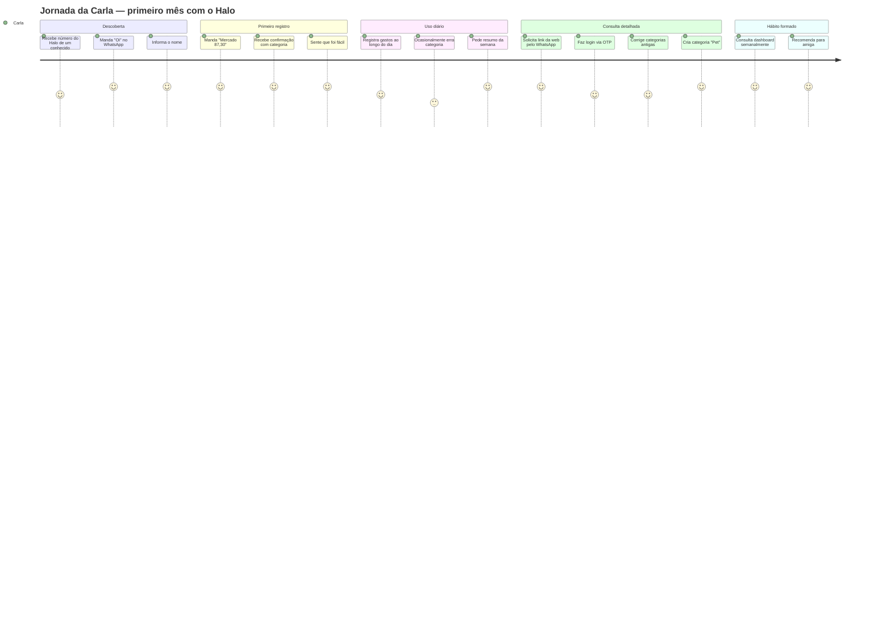
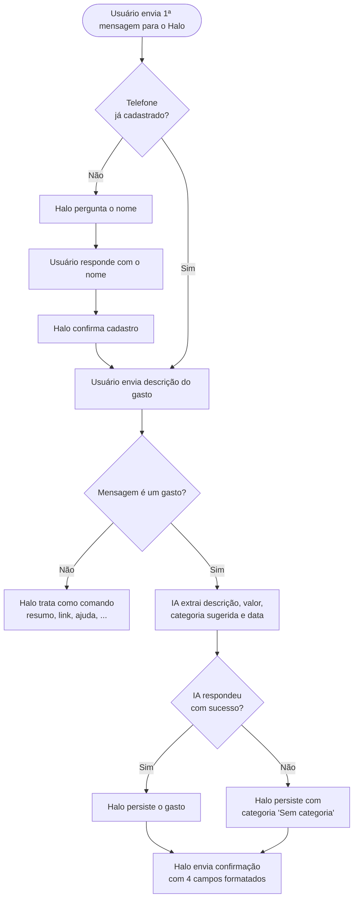
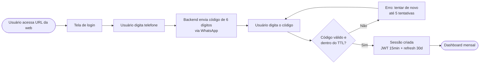
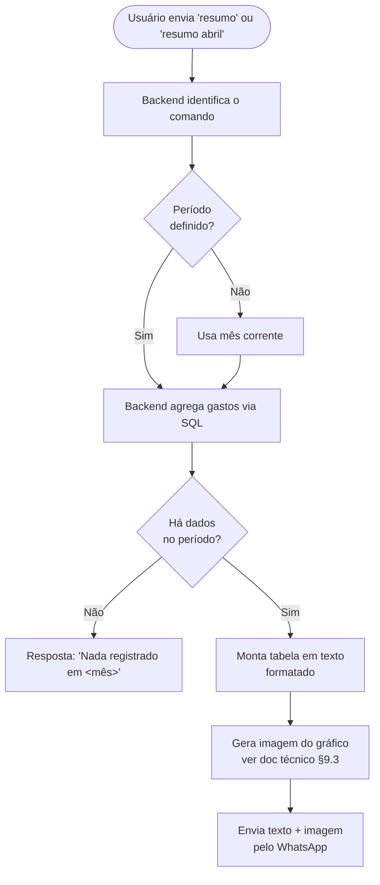

# PRD — Projeto Halo

> Product Requirements Document para o controle de gastos pessoais via WhatsApp + Web.
> Complementa [ideia-inicial.md](./ideia-inicial.md) e [analise-tecnica.md](./analise-tecnica.md) — este documento descreve **o que** deve ser construído e **por quê**; a análise técnica descreve **como**.

| Campo | Valor |
|---|---|
| Versão | 1.0 |
| Status | Draft para validação |
| Contexto | Mini-projeto acadêmico SENAI |
| Stakeholders | Aluno-desenvolvedor, Orientador |
| Última atualização | 2026-05-18 |

---

## 1. Visão do Produto

### 1.1 Problema
Pessoas que estão começando a se organizar financeiramente abandonam aplicativos de controle de gastos porque o registro exige **mudança de contexto** (abrir app, navegar até a tela, preencher formulário). O esforço diário é maior que o benefício percebido a curto prazo, e o usuário desiste antes de gerar histórico suficiente para enxergar valor.

### 1.2 Proposta de Valor
O Halo elimina a fricção do registro usando o **WhatsApp** — canal que o usuário já usa dezenas de vezes ao dia — como interface primária. O usuário escreve "Mercado 87,30" e a IA categoriza e arquiva automaticamente. Quando quiser entender seus gastos, consulta um dashboard web mobile-first ou pede um resumo direto no WhatsApp.

### 1.3 Objetivo do MVP
Validar que a hipótese acima funciona: **uma pessoa em início de organização financeira consegue manter o hábito de registro por pelo menos 4 semanas** quando a barreira de entrada é só uma mensagem de WhatsApp.

---

## 2. Persona

### 2.1 Persona Primária — "Carla, em busca de controle"

| Atributo | Descrição |
|---|---|
| Idade | 22–45 anos |
| Conhecimento financeiro | Baixo a intermediário — sabe que precisa controlar, mas nunca conseguiu manter uma planilha |
| Conhecimento técnico | Médio — usa WhatsApp, Instagram, Uber, iFood diariamente; não usa apps "complexos" |
| Motivação | Quer entender para onde vai o dinheiro; tem objetivo concreto (juntar para viagem, sair do vermelho, comprar algo) |
| Frustração com alternativas | Já tentou planilha (esqueceu de preencher), já baixou app (parou na 2ª semana) |
| Dispositivo | Smartphone Android/iOS; raramente abre o computador para tarefas pessoais |
| Frequência de uso esperada | Diária para registrar; semanal para consultar |

### 2.2 Cenários de Uso

| # | Cenário | Onde | Frequência |
|---|---|---|---|
| C1 | Registro rápido após uma compra | WhatsApp | Diária (3-10x) |
| C2 | Consulta "quanto gastei este mês?" | WhatsApp ou Web | Semanal |
| C3 | Revisão e correção de lançamentos antigos | Web | Quinzenal |
| C4 | Criação/edição de categoria customizada | Web | Eventual (1-2x no onboarding) |
| C5 | Recuperação de acesso à web | WhatsApp + Web | Eventual |

---

## 3. Métricas de Sucesso

O MVP é considerado **bem-sucedido** se, após 30 dias de uso por um grupo piloto (mínimo 3 usuários), atingir:

### 3.1 Engajamento
| Métrica | Meta MVP | Como medir |
|---|---|---|
| Gastos registrados por usuário ativo/semana | ≥ 10 | Query em `expenses` agrupando por `user_id` e semana |
| Usuários ativos na semana 4 / cadastrados | ≥ 60% | Cohort: cadastrou na semana 1 e registrou ao menos 1 gasto na semana 4 |
| % de registros via WhatsApp vs Web | ≥ 80% via WhatsApp | `expenses.source` agregado |

### 3.2 Qualidade da IA
| Métrica | Meta MVP | Como medir |
|---|---|---|
| % de mensagens corretamente identificadas como gasto | ≥ 90% | Amostragem manual em `whatsapp_messages` |
| % de categorizações aceitas sem correção manual | ≥ 75% | Comparar `expense.category_id` no momento da criação vs após eventual edição |
| Taxa de erro do parser (JSON inválido / fallback) | ≤ 5% | Log em `ai_log.status` |

> **Nota:** métricas de performance técnica (latência, uptime) estão definidas na §1.2 da [analise-tecnica.md](./analise-tecnica.md) como NFRs e não se repetem aqui.

---

## 4. Escopo

### 4.1 Dentro do MVP
- Cadastro conversacional via WhatsApp (nome + telefone).
- Registro de gasto via mensagem de texto livre (com categorização por IA).
- Confirmação imediata do registro pelo WhatsApp.
- Resumo mensal solicitado via WhatsApp (texto formatado + gráfico).
- Login web via OTP enviado pelo WhatsApp.
- Dashboard mobile-first com totais do mês e gráficos.
- CRUD de lançamentos pela web.
- CRUD de categorias customizadas pela web.
- Edição de perfil (nome) na web.

### 4.2 Fora do MVP (parking lot)
- Áudio e imagens (cupom fiscal) como entrada para a IA.
- Edição/exclusão de lançamentos pelo WhatsApp.
- Notificações proativas ("você gastou X em alimentação esta semana").
- Exportação de relatórios (CSV/PDF).
- Multi-moeda (somente BRL no MVP).
- Multi-idioma (somente pt-BR no MVP).
- Contas compartilhadas / família.
- Onboarding formal (landing page, fluxo de aquisição) — distribuição será informal entre conhecidos.
- Receitas/ganhos (apenas despesas no MVP; "Renda" existe como categoria mas tratada como gasto negativo só se houver tempo).
- Metas de gastos / alertas de orçamento.

---

## 5. Jornada do Usuário (alto nível)

---

## 6. Requisitos Funcionais

Cada requisito segue o formato `RF-XX` e tem critérios de aceitação verificáveis. Detalhes de implementação ficam na [analise-tecnica.md](./analise-tecnica.md).

### 6.1 Onboarding e Cadastro

#### RF-01 — Cadastro automático via WhatsApp
**Como** uma pessoa que ainda não tem conta,
**eu quero** enviar qualquer mensagem para o Halo,
**para que** eu seja guiada por uma conversa simples até estar cadastrada.

**Critérios de aceitação:**
- Ao receber a primeira mensagem de um número desconhecido, o Halo pergunta o nome.
- O Halo só considera "cadastrado" após receber e armazenar o nome.
- Mensagens enviadas antes da conclusão do cadastro **não** são interpretadas como gasto.
- A conversa de cadastro tem TTL de 15 min — se o usuário não responde, o estado é descartado e a próxima mensagem reinicia o fluxo.
- Mensagens duplicadas (mesmo `evolution_msg_id`) não criam usuários duplicados nem disparam perguntas repetidas.

#### RF-02 — Identificação por telefone
**Como** usuário cadastrado,
**eu quero** que o Halo me reconheça automaticamente pelo número,
**para que** eu não precise me autenticar a cada mensagem.

**Critérios de aceitação:**
- O telefone é normalizado em E.164 antes de qualquer busca/comparação.
- Cada telefone corresponde a exatamente uma conta (não há contas compartilhadas).

---

### 6.2 Registro de Gastos

#### RF-03 — Registro via mensagem de texto livre
**Como** usuário cadastrado,
**eu quero** enviar uma mensagem como "Mercado 87,30" ou "Gastei R$ 25 com Uber",
**para que** o Halo registre automaticamente o gasto com categoria sugerida.

**Critérios de aceitação:**
- A IA extrai: descrição, valor, categoria sugerida e data (se mencionada).
- Se a data não é mencionada, usa a data atual.
- A categoria sugerida deve estar entre as globais ou as customizadas do usuário.
- Se a IA falhar ou retornar JSON inválido, o Halo ainda registra o gasto com categoria "Sem categoria" — **nunca perde o registro**.
- Se a mensagem claramente não é um gasto (saudações, perguntas), o Halo **não** registra e responde adequadamente (resumo, ajuda, ou seguindo o fluxo conversacional).
- A confirmação de registro é enviada em até 3s (p95) — ver NFR §1.2 do doc técnico.

#### RF-04 — Mensagem de confirmação clara e acionável
**Como** usuário,
**eu quero** receber uma confirmação imediata mostrando descrição, valor, categoria e data,
**para que** eu saiba que foi registrado corretamente.

**Critérios de aceitação:**
- A mensagem de confirmação contém os 4 campos formatados.
- Inclui uma instrução curta sobre como corrigir (ex.: "Use a web para alterar.").
- Valor formatado como `R$ X.XXX,YY` (pt-BR).

#### RF-05 — Registro manual via Web
**Como** usuário,
**eu quero** registrar gastos manualmente na web,
**para que** eu possa lançar despesas antigas, em lote, ou que não consegui mandar pelo WhatsApp.

**Critérios de aceitação:**
- Formulário com: descrição (obrigatório), valor (obrigatório, > 0), categoria (obrigatório), data (obrigatório, default hoje).
- Validação em tempo real (React Hook Form + Zod).
- `expenses.source = 'WEB'` para registros criados aqui.

---

### 6.3 Categorias

#### RF-06 — Categorias globais pré-cadastradas
**Como** usuário novo,
**eu quero** já encontrar um conjunto razoável de categorias,
**para que** eu não precise configurar nada antes de começar.

**Critérios de aceitação:**
- Categorias globais semeadas via Flyway: Alimentação, Mercado, Transporte, Lazer, Saúde, Moradia, Educação, Vestuário, Serviços, Investimento, Renda, Outros.
- Cada categoria tem ícone e cor associados (para uso no frontend).
- Categorias globais são visíveis para todos os usuários por padrão.

#### RF-07 — Categorias customizadas
**Como** usuário,
**eu quero** criar minhas próprias categorias,
**para que** o controle reflita meus padrões de gasto reais (ex.: "Pet", "Academia").

**Critérios de aceitação:**
- CRUD completo na web: criar, editar nome/ícone/cor, desativar.
- Categoria customizada só é visível para o usuário que a criou.
- Não pode haver duas categorias ativas com o mesmo nome para o mesmo usuário.
- Desativar uma categoria **não** afeta lançamentos passados (eles mantêm a categoria); apenas remove a categoria das opções futuras.

#### RF-08 — Edição de categorias globais "herdadas"
**Como** usuário,
**eu quero** poder customizar uma categoria global (ex.: trocar a cor de "Alimentação"),
**para que** ela se adapte à minha preferência sem perder a base.

**Critérios de aceitação:**
- Ao editar uma categoria global, o sistema cria uma cópia do usuário (`categories.global_id` aponta para o original).
- Lançamentos passados são re-vinculados à categoria do usuário automaticamente, OU permanecem na global (decidir na implementação — ver §17 do doc técnico).

---

### 6.4 Login e Acesso à Web

#### RF-09 — Autenticação por OTP via WhatsApp
**Como** usuário,
**eu quero** acessar a web sem ter que criar/lembrar senha,
**para que** o login seja tão simples quanto o registro.

**Critérios de aceitação:**
- Usuário informa telefone na tela de login → recebe código de 6 dígitos no WhatsApp em até 30s.
- Código tem TTL de 5 min e expira após 5 tentativas erradas.
- Cooldown de 60s entre solicitações para o mesmo telefone.
- Mensagem do OTP inclui aviso explícito: "Nunca compartilhe este código."
- Após verificação bem-sucedida, sessão tem 30 dias de validade (refresh token).

#### RF-10 — Solicitar link da web via WhatsApp
**Como** usuário que esqueceu o endereço,
**eu quero** pedir o link no WhatsApp,
**para que** eu não precise sair do app onde já estou.

**Critérios de aceitação:**
- Mensagens como "site", "link", "web", "acessar" disparam resposta com a URL da aplicação web.
- Lista de gatilhos pode evoluir; comando é tratado antes do parser de gasto.

#### RF-11 — Logout
**Como** usuário,
**eu quero** encerrar minha sessão web,
**para que** outras pessoas não acessem meus dados caso eu esteja em dispositivo compartilhado.

**Critérios de aceitação:**
- Botão "Sair" no menu de perfil.
- Após logout, o refresh token é revogado no backend e o cookie é limpo.

---

### 6.5 Visualização e Edição

#### RF-12 — Dashboard mensal
**Como** usuário,
**eu quero** abrir a web e ver imediatamente meus gastos do mês,
**para que** eu tenha resposta rápida à pergunta "como estou indo?".

**Critérios de aceitação:**
- Página inicial após login mostra:
  - Total gasto no mês corrente.
  - Top 5 categorias com valor e %.
  - Gráfico de pizza ou barras.
  - Últimos 10 lançamentos.
- Layout mobile-first; desktop é progressive enhancement.

#### RF-13 — Lista filtrável de lançamentos
**Como** usuário,
**eu quero** filtrar meus lançamentos por período e categoria,
**para que** eu encontre rapidamente um gasto específico.

**Critérios de aceitação:**
- Filtros: período (de/até), categoria, busca textual em descrição.
- Paginação ou scroll infinito.
- Ordenação padrão: data desc.

#### RF-14 — Edição/exclusão de lançamento
**Como** usuário,
**eu quero** corrigir ou apagar lançamentos antigos,
**para que** meu histórico reflita a realidade.

**Critérios de aceitação:**
- Edição permite alterar: descrição, valor, categoria, data.
- Exclusão é **soft delete** (`deleted_at` setado, registro não some do banco).
- Lançamentos editados/excluídos aparecem em logs de auditoria (campo `updated_at`).

---

### 6.6 Resumos via WhatsApp

#### RF-15 — Resumo do mês corrente
**Como** usuário,
**eu quero** pedir "resumo" no WhatsApp e receber um panorama,
**para que** eu tenha resposta sem abrir nenhum app.

**Critérios de aceitação:**
- Comandos disparadores: "resumo", "resumo do mês", "quanto gastei".
- Resposta inclui:
  - Total gasto no mês.
  - Lista de categorias com valor e %, ordenada desc, formatada em texto monoespaçado.
  - Imagem do gráfico (ver §9.3 do doc técnico).
- Latência alvo: < 8s p95.

#### RF-16 — Resumo de mês anterior
**Como** usuário,
**eu quero** pedir "resumo de abril",
**para que** eu compare com meses passados.

**Critérios de aceitação:**
- Reconhece nome de mês (pt-BR completo ou abreviado) com ou sem ano.
- Se não houver dados no período, responde com mensagem amigável.

---

### 6.7 Perfil

#### RF-17 — Edição de nome
**Como** usuário,
**eu quero** corrigir meu nome,
**para que** as mensagens do bot me chamem corretamente.

**Critérios de aceitação:**
- Tela de perfil permite editar nome (telefone é imutável).
- Atualização reflete na próxima interação via WhatsApp.

---

## 7. Requisitos Não-Funcionais

Os NFRs detalhados estão na [analise-tecnica.md §1.2 e §10](./analise-tecnica.md). Os principais para validação do MVP:

| Categoria | Requisito |
|---|---|
| Performance | Resposta WhatsApp (texto) < 3s p95; gráfico < 8s p95 |
| Disponibilidade | 99% (single-VPS, best-effort para o MVP) |
| Resiliência | Falha de IA não bloqueia registro — fallback "Sem categoria" |
| Segurança | HTTPS obrigatório, OTP com hash bcrypt, JWT em memória (não localStorage), webhook do Evolution sem auth dedicada — Evolution Go self-hosted não envia auth em webhooks de saída; proteção por rede/reverse proxy |
| Privacidade | Logs nunca contêm OTP, JWT, ou mensagens financeiras com valor identificável (apenas hashes/prefixos) |
| Acessibilidade | Mobile-first; contraste mínimo WCAG AA na web |
| Custo | < R$ 1,00 / usuário ativo / mês com IA (target) |
| Idioma | Apenas pt-BR no MVP |
| Moeda | Apenas BRL no MVP |

---

## 8. Fluxos de Negócio (resumido)

> Fluxos técnicos detalhados (sequência de chamadas) estão em [analise-tecnica.md §7](./analise-tecnica.md). Aqui ficam os fluxos visto pela ótica do usuário.

### 8.1 Fluxo: Primeiro registro de um novo usuário

### 8.2 Fluxo: Acesso à web

### 8.3 Fluxo: Pedido de resumo

---

## 9. Critérios de Pronto (Definition of Done) por Release

> Estes critérios complementam as fases técnicas do [doc técnico §15](./analise-tecnica.md) com a lente de produto.

### Release 1 — MVP WhatsApp (fim das fases 0+1 do técnico)
- [ ] RF-01, RF-02, RF-03, RF-04 implementados e testados manualmente.
- [ ] Pelo menos 1 usuário externo (não o desenvolvedor) consegue se cadastrar e registrar 5 gastos sem ajuda.
- [ ] IA categoriza corretamente ≥ 75% dos casos em uma amostra de 20 mensagens reais.

### Release 2 — Web mínima (fim da fase 2)
- [ ] RF-05, RF-09, RF-11, RF-12, RF-13, RF-14, RF-17 implementados.
- [ ] Usuário consegue logar, ver dashboard, editar e excluir lançamentos.
- [ ] Testado em pelo menos 1 smartphone Android e 1 iOS reais.

### Release 3 — Categorias + relatórios (fim das fases 3+4)
- [ ] RF-06, RF-07, RF-08, RF-10, RF-15, RF-16 implementados.
- [ ] Gráfico via WhatsApp funcionando com Opção A (determinística).

### Release 4 — Hardening + Deploy produção (fase 5)
- [ ] HTTPS, rate limits, backups configurados.
- [ ] Pelo menos 3 usuários em piloto por 30 dias.
- [ ] Métricas da §3 medidas e reportadas.

---

## 10. Premissas

1. **Disponibilidade do WhatsApp do operador**: o número do Halo (Evolution GO) precisa permanecer conectado; queda exige reconexão manual via QR code.
2. **Gemini API ativa**: o projeto depende da chave de API e do plano da Google sem interrupção.
3. **Conhecimento técnico do usuário**: o usuário tem o WhatsApp instalado e funcional; não precisamos cobrir esse cenário.
4. **Apenas BRL no MVP**: nenhum requisito de internacionalização ou multi-moeda foi solicitado.
5. **Apenas pt-BR**: a IA é prompted em português; o frontend é em português.
6. **Distribuição informal**: o canal de aquisição/onboarding formal fica fora do MVP — usuários iniciais virão por convite direto.
7. **Dispositivo único**: o usuário acessa a web normalmente pelo mesmo telefone que registra os gastos no WhatsApp.

---

## 11. Dependências Externas

| Dependência | Risco se cair | Mitigação |
|---|---|---|
| Evolution GO + número WhatsApp | Alto — sem isso, canal primário fica indisponível | Healthcheck dedicado; runbook de reconexão |
| Gemini API | Médio — registros continuam funcionando com fallback "Sem categoria" | Categoria de fallback automática + alerta |
| VPS (host) | Alto — derruba tudo | Backup diário do Postgres; runbook de restore |
| DNS / TLS | Médio — afeta web e webhook | Let's Encrypt auto-renew; monitorar expiração |

---

## 12. Riscos de Produto

> Riscos técnicos detalhados estão em [analise-tecnica.md §16](./analise-tecnica.md). Aqui ficam os riscos com lente de produto.

| Risco | Probabilidade | Impacto | Mitigação |
|---|---|---|---|
| Usuário desiste antes de chegar ao "momento aha" (1ª confirmação satisfatória) | Média | Alto | Polimento da mensagem de cadastro e da 1ª confirmação; medir abandono entre 1ª e 5ª mensagem |
| IA categoriza errado com frequência e usuário se frustra | Média | Alto | Métrica §3.2; permitir correção fácil na web; cache de classificação por descrição |
| Privacidade — usuário não confia em mandar dados financeiros para um número desconhecido | Média | Médio | Mensagem de boas-vindas explicitando o que é o serviço; futura página "sobre" |
| Phishing — alguém pede o OTP via engenharia social | Baixa | Alto | Mensagem do OTP avisa "Nunca compartilhe"; revisar texto periodicamente |
| Usuário esquece o número do Halo | Média | Baixo | RF-10 resolve via WhatsApp; futuro: landing page |
| Usuário não entende como editar/excluir um gasto via WhatsApp (fora do MVP) | Alta | Baixo | Confirmação inclui instrução "Use a web para alterar" |

---

## 13. Glossário

| Termo | Definição |
|---|---|
| **OTP** | One-Time Password — código de uso único enviado via WhatsApp para autenticação na web |
| **Webhook** | Endpoint do backend que recebe eventos do Evolution GO quando mensagens chegam |
| **E.164** | Formato internacional de telefone: `+<código-país><número>` (ex.: `+5547999999999`) |
| **PWA** | Progressive Web App — web app instalável na home screen, com cache offline básico |
| **Idempotência** | Garantia de que processar a mesma mensagem 2x não cria 2 gastos |
| **Soft delete** | Marcar como deletado sem remover do banco — preserva histórico/auditoria |
| **Categoria global** | Categoria pré-cadastrada disponível para todos os usuários |
| **Categoria customizada** | Categoria criada pelo usuário, visível apenas para ele |

---

## 14. Questões em Aberto

1. **Edição/exclusão via WhatsApp** — não está no MVP, mas é fricção real. Quando incluir? Sugestão: após release 4, observar pedidos dos usuários piloto.
2. **Mensagens fora de padrão** — como o Halo deve responder a "oi, tudo bem?" ou "qual seu nome?" depois do cadastro? Definir tom e fallback antes da Release 1.
3. **Múltiplos gastos em uma mensagem** — "Mercado 80 e farmácia 30" — registrar como 2 gastos ou pedir confirmação? Sugestão: tratar como múltiplos automaticamente se o parser conseguir; documentar como "feature emergente" e medir acurácia.
4. **Política de retenção** — quanto tempo mantemos `whatsapp_messages.content`? Há considerações de LGPD a explorar antes de produção real.
5. **Critério de exclusão de conta** — como o usuário deleta tudo? Comando WhatsApp? Tela na web? Decidir antes do piloto com terceiros.
6. **Aceitação de feedback do usuário** — onde a Carla reporta um bug ou sugestão? Sem canal formal no MVP — definir antes do piloto.

---

## 15. Próximos Passos Imediatos

1. **Validar este PRD** com o orientador e ajustar antes da implementação.
2. **Priorizar RFs em backlog** (board de cards) seguindo o agrupamento de releases da §9.
3. **Definir critérios de seleção do piloto** (3+ usuários reais para validar métricas da §3).
4. **Preparar formulário simples** de coleta de feedback durante o piloto (Google Form, ou link no perfil web).
5. **Acompanhar evolução técnica** pela [analise-tecnica.md](./analise-tecnica.md) — este PRD é referência de **o quê** e **por quê**; o doc técnico é a referência de **como**.

---

> Este PRD é vivo. Mudanças de escopo, novas personas ou mudanças de métrica devem ser registradas via atualização versionada (incrementar a versão no topo).
